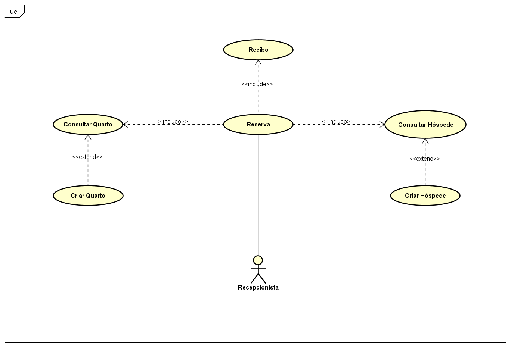

# 🏨 Sistema de Hotelaria para a COP30 - H-Cop

Este é um sistema de hotelaria desenvolvido para ser utilizado localmente por estabelecimentos durante a COP30. O sistema permite gerenciar quartos, hóspedes, reservas e emitir recibos em PDF.

## 🚀 Tecnologias Utilizadas

- PHP 8.x
- Laravel 12.x
- MySQL
- Docker + Docker Compose
- Nginx
- [Spatie/Browsershot](https://github.com/spatie/browsershot) (para geração de PDFs)
- Puppeteer + Google Chrome headless

## 🧱 Estrutura do Projeto

O sistema foi organizado em milestones e issues para facilitar o rastreamento das tarefas concluídas. A estrutura inclui:

- Infraestrutura com Docker (app, db, nginx, phpmyadmin)
- Sistema de autenticação simples (apenas usuário admin)
- Gerenciamento de quartos e reservas
- Visualização de disponibilidade por capacidade e vagas
- Filtros personalizados com paginação persistente
- Geração de PDF para recibos
- Interface simples e funcional

## ⚙️ Instalação (Ambiente de Desenvolvimento)

### 1. Pré-requisitos

- [Docker](https://www.docker.com/)
- [Docker Compose](https://docs.docker.com/compose/)

### 2. Clonar o repositório

```bash
git clone https://github.com/JohanGarciaO/h-cop.git
cd h-cop
```

### 3. Copiar os arquivos de variáveis de ambiente e ajustá-los conforme necessário

```bash
cp .env.example .env
cp src/.env.example src/.env
```

### 4. Subir os containers e entrar no container da aplicação

```bash
docker compose up -d --build
docker exec -it hotelaria_app bash
```

### 5. Instalar as dependências dentro do container

```bash
composer install
npm install
```

### 6. Gerar a chave da aplicação

```bash
php artisan key:generate
```

### 7. Rodar as migrations e popular o banco com os dados mínimos

```bash
php artisan migrate --seed
```

### 8. Acessar o sistema

Abra no navegador: [http://localhost](http://localhost)

## 👤 Acesso Padrão

- **Usuário:** admin
- **Senha:** hcop\*hroot _(ou defina conforme seu seeder)_

## 📂 Organização do Projeto

As tarefas estão descritas por milestones nas issues do repositório.
Outros modelos de visualização (como Kanban board) podem ser encontrados no [Project board](https://github.com/JohanGarciaO/h-cop/projects).

## 📊 Diagramas

### Diagrama de Casos de Uso



## 📝 Licença

Este projeto está sob a licença MIT. Sinta-se à vontade para usar, modificar e distribuir.
